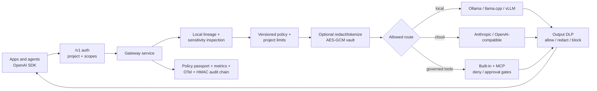

# Yagami Private AI Gateway

**One OpenAI-compatible endpoint that decides what data may leave the device, which models and tools may receive it, what may be remembered, and records evidence for every decision.**

[](https://github.com/MatthewTracy/yagami/actions/workflows/ci.yml)
[](LICENSE)
[](https://www.python.org/downloads/)
[](#tests-and-quality)
[](#status)

Yagami is a local-first policy gateway for applications and agents that use a mix of local and cloud AI. Every request is classified on-device, evaluated against a versioned policy, routed to an allowed backend, and recorded in a privacy-conscious decision ledger. Detected or caller-declared PHI and secrets are forced local.

Existing OpenAI SDK applications can use Yagami by changing `base_url`. The included React chat remains a useful demo and local control surface, but the gateway works headlessly in Docker or directly from Python.

> Detection is probabilistic; enforcement after a sensitive label is deterministic. Strict deployments should supply `metadata.sensitivity`, use a local-only policy, or both. See [Threat model](docs/threat-model.md).

## Demo

https://github.com/user-attachments/assets/a7be9449-eafc-4acb-99b6-ea39edc43cd2

---

## What a turn looks like

```
You: what is 2+2
  -> ollama (local)        rules-fast-path                              1.6s

You: write a Python decorator that memoizes
  -> ollama (local)        intent=code, fast-path                       2.4s

You: explain quantum entanglement in 100 words
  -> ollama (local)        intent=simple_qa, fast-path                  3.0s

You: prove the halting problem is undecidable
  -> anthropic (cloud)     complexity=high, intent=complex_reasoning    8.1s

You: what is 14 factorial
  -> anthropic + tools     needs_tools=true (calc.eval: 87178291200)    3.4s

You: Patient Jenny, 54, dyspnea + hypertension. Summarize.
  -> ollama (local)        sensitivity=phi_medical, forced local        2.1s
  -> applies a clinical-documentation system prompt

You: /image a red sailboat at sunset
  -> stability (cloud)     slash override, intent=image                 4.7s
```

Every routing decision lands in a Privacy Ledger panel with the reasoning and timing. Cloud rows highlight amber. The user prompt is scrubbed of SSN / credit card / email / phone patterns before it touches the ledger DB.

---

## Why local-first

- **Privacy by default.** Once PHI, secrets, or clinical content is detected or declared, it cannot use a remote backend. The `phi_must_be_local` rule is pinned on at routing time and on every config write (defense in depth).
- **Cost control.** A daily spend cap (`daily_spend_cap_usd`) refuses cloud routes once exceeded; local stays available. Live cost meter in the UI.
- **Right model for the job.** Trivial small-talk doesn't pay a frontier-model round trip. Hard reasoning doesn't get stuck on a 3B local model.
- **Cross-session memory that respects privacy.** PHI rows get a 7-day TTL, never surface in non-PHI sessions, and never reach the embedding worker if tagged `secret`.

---

## Where Yagami fits

| Tool | Role |
|---|---|
| Open WebUI, LibreChat | Chat UIs over an existing model |
| LangChain, LlamaIndex | SDKs you call from your own server |
| Continue, Cursor | IDE-side AI agents |
| LiteLLM, Portkey | General provider gateways, retries, budgets, and broad integrations |
| **Yagami** | A private-AI policy gateway: local classification, sensitive-data containment, governed model/tool routes, and policy evidence |

Yagami can sit directly in front of model providers or in front of another OpenAI-compatible gateway. Provider breadth is not the moat; privacy enforcement and context lineage are.

---

## Status

Alpha. OpenAI-compatible Chat Completions (including caller function tools) plus a core Responses API, versioned policy evaluation/replay, multi-key project identity and scoped service accounts, lineage, reversible privacy transformation, output DLP, one-time tool approvals, hash-chained audit evidence, Prometheus/OpenTelemetry, governed remote MCP, and hardened container packaging. The desktop chat is optional; headless Linux containers and Windows 11 are both supported.

---

## Five-minute gateway quickstart

### Install a release

Install the Python CLI and server from PyPI:

```bash
pip install yagami==0.4.1
```

Or pull the immutable multi-architecture container tag:

```bash
docker pull ghcr.io/matthewtracy/yagami:0.4.1
```

Published wheels, source archives, and container digests include checksums,
SBOMs, license inventory, and GitHub build-provenance attestations. See
[Release integrity and verification](docs/releases.md) before promoting an
artifact into a production environment.

### Docker Compose

```powershell
$env:YAGAMI_API_KEYS = "dev:replace-with-at-least-16-characters"
docker compose up --build
```

The Compose service binds only to `127.0.0.1:8000`, requires bearer authentication, stores its database in a named volume, and connects to Ollama on the host by default.

### Use the OpenAI SDK

```python
from openai import OpenAI

client = OpenAI(
    base_url="http://127.0.0.1:8000/v1",
    api_key="replace-with-at-least-16-characters",
)

response = client.chat.completions.create(
    model="yagami-auto",
    messages=[{"role": "user", "content": "Summarize this document."}],
    metadata={
        "purpose": "internal-documentation",
        "sensitivity": "none",
        "session_id": "example-session",
    },
)
print(response.choices[0].message.content)
```

Supported caller sensitivity values today are `none`, `phi`, `phi_medical`, and `secret`. A sensitive hint can make policy stricter but cannot relax a sensitivity detected by Yagami.

Useful endpoints:

- `POST /v1/chat/completions`
- `POST /v1/responses` (core text/streaming surface)
- `GET /v1/models`
- `GET /v1/policy`
- `POST /v1/policy/preview`
- `POST /v1/policy/replay`
- `POST /v1/privacy/transform` and `/v1/privacy/rehydrate`
- `POST /v1/tool-approvals`
- `GET /v1/audit/verify` and `/v1/audit/events`
- `GET /healthz`
- `GET /metrics`

See [Gateway API](docs/gateway.md), [Policy configuration](docs/policies.md), and [Deployment](docs/deployment.md).

---

## Local chat application quickstart

Requires [Ollama](https://ollama.com/download), Python 3.11+, and Node 20+.
Windows is the primary target (the notes below assume it); the Python and
React halves also run on macOS / Linux, and CI exercises the Python half on
Windows and Ubuntu with every supported Python version.

Yagami intentionally listens on localhost. Its local admin/chat routes do not
have a separate interactive user login; the `/v1` gateway has scoped bearer
authentication. A non-loopback `--host` requires the explicit
`--allow-remote` flag; use that only behind a trusted, authenticated reverse
proxy. To use the browser UI remotely, also repeat
`--trusted-origin https://your-yagami-host` for every allowed origin.

### One command

```powershell
# Windows
.\scripts\setup.ps1
```

```bash
# macOS / Linux
./scripts/setup.sh
```

This pulls the three required Ollama models (skipping any already present),
creates/activates a venv, installs the Python package, installs the UI's
`npm` dependencies, and runs `yagami.doctor` so you know immediately if
something's missing. It won't set your cloud API keys for you — see step 3
below for that.

### Manual steps

```powershell
# 1. Install Ollama and pull three models.
ollama pull llama3.2:3b-instruct-q4_K_M   # default local generator
ollama pull phi4-mini                     # classifier
ollama pull all-minilm                    # memory embeddings (45 MB)

# 2. Python env.
python -m venv .venv
.venv\Scripts\Activate.ps1        # macOS/Linux: source .venv/bin/activate
pip install -e ".[dev]"

# 3. API keys go in the OS keyring (NOT .env). Only ANTHROPIC_API_KEY is
# needed for the default routing table; the rest are optional cloud backends.
python -m yagami.set_key ANTHROPIC_API_KEY
python -m yagami.set_key STABILITY_API_KEY
# python -m yagami.set_key OPENAI_API_KEY       # optional
# python -m yagami.set_key MISTRAL_API_KEY      # optional
# python -m yagami.set_key GROQ_API_KEY         # optional
# python -m yagami.set_key OPENROUTER_API_KEY   # optional
# python -m yagami.set_key GEMINI_API_KEY       # optional

# 4. UI deps.
cd ui
npm install
cd ..
```

Sanity check: `python -m yagami.doctor` verifies the daemon, the models, the keys.

### Run it

**Quick try** (one terminal, no hot reload) — build the UI once, then the
`yagami` CLI serves the API and the built UI together:

```powershell
cd ui ; npm run build ; cd ..
yagami
# open http://localhost:8000
```

**Development** (two terminals, UI hot-reload):

```powershell
yagami --reload         # terminal 1 - API on :8000
cd ui ; npm run dev     # terminal 2 - UI on :5173, proxies to the API
# open http://localhost:5173
```

`yagami --reload` is equivalent to the old
`uvicorn yagami.main:app --reload --reload-dir src/yagami` invocation, just
shorter to type.

---

## How it routes

[`src/yagami/router/policy.py`](src/yagami/router/policy.py) applies, in order:

1. **Slash override** ([`/cloud /local /image /think /code /reset /openai`](#slash-commands)) wins immediately, with one exception: PHI / secret content refuses cloud overrides with an explicit error.
2. **Programmatic `force_backend`** from the WebSocket message wins next, same PHI guard.
3. **Fast-path bypass** for short prompts that are clearly trivial, clearly image-creation, or contain a secret-shaped regex hit. Skips the LLM classifier for roughly 70% of typical turns; cuts time-to-first-token to around 300 ms.
4. **LLM classifier** for everything else. Phi-4 Mini in JSON mode emits `{intent, sensitivity, complexity, needs_tools, needs_recall}`.

The decision tree then:

```
sensitivity in {phi, phi_medical, secret}    -> forced local (Ollama)
intent == image                              -> Stability (prompt only, no history)
needs_tools                                  -> Claude with tool-use loop
complexity == high or complex_reasoning      -> Claude
needs_recall                                 -> inject top-K memories, then route
default                                      -> local Ollama
```

Two refinements:

- **Per-turn `history_has_phi` gate.** Cloud text routes are refused if any prior turn in the session contained PHI, because we'd ship that history along. Image gen and the local model don't trigger this check (Stability only sees the current prompt; local stays local). Use `/reset <prompt>` to send that prompt with a fresh model context; prior messages stay visible in the chat but are omitted from the backend request.
- **Sticky retrieval, not sticky sensitivity.** The earlier sticky-floor design was replaced in v0.2.10: each turn is classified on its own merits, and the history gate is what protects cloud routes.

---

## Slash commands

Type at the start of a message.

| Command | Effect |
|---|---|
| `/cloud` or `/claude` | Force this turn to Claude. |
| `/local` or `/ollama` | Force this turn to the local model. |
| `/image` | Force this turn to Stability image gen. |
| `/think` | Force Claude with `complexity=high` hint. |
| `/code` | Stay local; tag as a code task. |
| `/reset` | Send this turn with a fresh model context; prior messages are not sent. |
| `/<backend-name>` | Force this turn to any other configured backend, e.g. `/openai`, `/mistral`, `/groq`, `/openrouter`, `/gemini`. Works for any backend currently in `/api/health` — nothing to register. |

All overrides honor the PHI guard. `/cloud` on a PHI prompt is refused with an explicit error.

---

## Features at a glance

| Capability | Where it lives |
|---|---|
| OpenAI-compatible headless gateway + caller function tools | `POST /v1/chat/completions`, core `/v1/responses` |
| Versioned policy, preview/replay, and content-free passports | [`src/yagami/policy/`](src/yagami/policy), `/v1/policy/*` |
| Project service accounts, limits, scopes, and one-time tool approvals | [`src/yagami/auth.py`](src/yagami/auth.py), [`src/yagami/projects.py`](src/yagami/projects.py) |
| Context lineage, AES-GCM tokenization, and output DLP | [`src/yagami/governance/`](src/yagami/governance) |
| Verifiable SHA-256/HMAC audit chain + NDJSON export | [`src/yagami/telemetry/audit.py`](src/yagami/telemetry/audit.py), `/v1/audit/*` |
| Streaming chat over WebSocket | [`src/yagami/chat/stream.py`](src/yagami/chat/stream.py) |
| Per-turn classification (Phi-4 Mini, JSON mode) | [`src/yagami/router/classifier.py`](src/yagami/router/classifier.py) |
| Fast-path bypass with PHI / secret / image regexes | [`src/yagami/router/fast_path.py`](src/yagami/router/fast_path.py) |
| Backend registry (drop-in plugins) | [`src/yagami/backends/registry.py`](src/yagami/backends/registry.py) |
| 9 backends out of the box (Ollama, llama.cpp local; Anthropic, OpenAI, Mistral, Groq, OpenRouter, Gemini, Stability cloud) | [`src/yagami/backends/`](src/yagami/backends) |
| Multi-turn tool-use loop (Anthropic) | [`src/yagami/router/tool_loop.py`](src/yagami/router/tool_loop.py) |
| First-party skills (`calc.eval`, `web.fetch`) | [`src/yagami/skills/`](src/yagami/skills) |
| Cross-session memory with sqlite-vec + FTS5 fallback | [`src/yagami/memory/`](src/yagami/memory) |
| Folder-indexed document knowledge base (`kb.recall` skill) | [`src/yagami/memory/documents.py`](src/yagami/memory/documents.py), `POST /api/kb/index` |
| Governed stdio/Streamable HTTP MCP client with bearer/OAuth auth | [`src/yagami/skills/mcp_manager.py`](src/yagami/skills/mcp_manager.py), `GET /api/mcp` |
| Cost meter + daily spend cap | [`src/yagami/telemetry/costs.py`](src/yagami/telemetry/costs.py) |
| Auto-retry on transient cloud errors | [`src/yagami/backends/retry.py`](src/yagami/backends/retry.py) |
| File ingest (PDF / MD / TXT, drag-drop) | [`src/yagami/ingest/extract.py`](src/yagami/ingest/extract.py) |
| Vision input (Claude, Gemini, OpenAI, OpenRouter) | `ImageAttachment` on `Message`; auto-picks the first configured vision backend |
| Durable vision history | Input images are stored as message-scoped SQLite blobs and restored on conversation reload |
| Privacy Ledger panel | [`ui/src/components/PrivacyLedger.tsx`](ui/src/components/PrivacyLedger.tsx) |
| Settings modal (live config edit) | [`ui/src/components/SettingsModal.tsx`](ui/src/components/SettingsModal.tsx) |
| Stats dashboard | [`ui/src/components/StatsDashboard.tsx`](ui/src/components/StatsDashboard.tsx) |
| Memory panel (search / delete) | [`ui/src/components/MemoryPanel.tsx`](ui/src/components/MemoryPanel.tsx) |
| Thumbs up / down feedback | `/api/decisions/{id}/feedback` |
| Privacy Ledger CSV export (compliance/audit) | `GET /api/decisions/export`, [`telemetry/decisions.py`](src/yagami/telemetry/decisions.py) |
| Privacy lifecycle controls | Settings Privacy tab; retention cleanup, complete JSON export, and verified deletion APIs under `/api/privacy` |
| Config profiles (e.g. strict-PHI work vs. permissive personal) | [`src/yagami/config.py`](src/yagami/config.py) `ProfileOverrides` / `effective_routing`, Settings → Profiles tab |

---

## Architecture



The optional React application remains a local demo and administration surface:

```
                          +-------------------+
                          |   React + Vite    |
                          |  (Chat, Settings, |
                          |   Stats, Memory)  |
                          +---------+---------+
                                    | WS / REST
                                    v
+-----------------+  +--------------------------+  +------------------+
|  Privacy        |  |    FastAPI (uvicorn)     |  |  OS Keyring      |
|  Ledger DB      <--+   /ws/chat, /api/*       +-->  (DPAPI / etc.)  |
|  (sqlite)       |  +-----+--------------+-----+  +------------------+
+-----------------+        |              |
                           v              v
            +--------------+----+    +----+-------------+
            | Router policy +   |    |  Cross-session    |
            | fast_path +       |    |  memory:          |
            | classifier        |    |  sqlite-vec       |
            | (Phi-4 Mini JSON) |    |  + embedding      |
            +---+-----+-----+---+    |  worker           |
                |     |     |        +-------------------+
                v     v     v
        +-------+---------------------------------------------+
        |  Backend registry (filesystem-discovered)            |
        |  Echo · Ollama · Anthropic · OpenAI · Stability ·     |
        |  Mistral · Groq · OpenRouter · Gemini · llama-cpp     |
        +-------------------------+------------------------+---+
                                   |
                                   v  (Anthropic only, today)
                     +----------+----------+
                     |  tool_loop:         |
                     |  calc.eval,         |
                     |  web.fetch, ...     |
                     +---------------------+
```

Three operating principles:

1. **One governed data plane.** Chat Completions and Responses share `GatewayService`; routing, policy, transformation, output inspection, budgets, lineage, and evidence cannot drift between endpoints.
2. **Sensitive routes fail closed.** Once content is detected or declared sensitive, the eligible backend set contains only local targets. Classifier failure defaults local and refuses an explicit cloud override.
3. **Evidence excludes content.** Metrics, spans, lineage, approvals, and audit events keep IDs, labels, counts, hashes, and fingerprints—not prompt, response, tool, or arbitrary metadata values.

---

## Adding your own backend

Yagami ships Anthropic, OpenAI, Mistral, Groq, OpenRouter, and Gemini out of
the box (plus local Ollama / llama.cpp). The last four are ~30-line files
because their APIs all speak the same OpenAI-compatible wire format — see
[`src/yagami/backends/openai_compat.py`](src/yagami/backends/openai_compat.py)
for the shared `generate()`/`health()` implementation, and
[`src/yagami/backends/groq.py`](src/yagami/backends/groq.py) for the
shortest real example of subclassing it. If your provider is
OpenAI-compatible too (most are, or offer a compatibility endpoint), that's
the pattern to copy.

For a provider with its own wire format, write `generate()`/`health()`
directly — here's Together AI as a from-scratch example:

```python
# src/yagami/backends/together.py
from __future__ import annotations
from typing import AsyncIterator
from ..config import YagamiConfig
from .base import Backend, BackendChunk, BackendOptions, Capability, Message, Pricing


def build(cfg: YagamiConfig, secrets_get) -> "TogetherBackend | None":
    key = secrets_get("TOGETHER_API_KEY")
    if not key:
        return None
    return TogetherBackend(key)


class TogetherBackend(Backend):
    name = "together"
    capabilities = {Capability.TEXT, Capability.LONG_CONTEXT}
    is_local = False
    pricing = Pricing(input_per_million_tokens=0.88, output_per_million_tokens=0.88)

    def __init__(self, key: str) -> None: ...

    async def generate(self, messages: list[Message], *, options: BackendOptions) -> AsyncIterator[BackendChunk]:
        ...

    async def health(self) -> bool:
        return True
```

`python -m yagami.set_key TOGETHER_API_KEY`, add a `[together]` section to
`config.py`'s `YagamiConfig` if you need per-provider settings, restart
`yagami`, and it shows up in `/api/health`, the Settings backend dropdown,
and as `/together` (see [Slash commands](#slash-commands) — any registered
backend name works as a slash command automatically, nothing to wire up).

Note: the auto-router's `needs_tools` / `complexity=high` escalation path
(`RoutingPolicy._apply_rules` in
[`src/yagami/router/policy.py`](src/yagami/router/policy.py)) currently only
escalates to `anthropic` specifically, since it's the only backend wired
into `tool_loop`. A new backend is reachable immediately via `/`, the
Settings default-backend dropdown, or `force_backend` — just not via that
one auto-escalation rule yet.

## Adding your own skill

```python
# src/yagami/skills/clipboard_paste.py
from ..router.schema import Sensitivity
from .base import Skill, SkillContext, SkillResult


def build() -> Skill:
    return ClipboardPaste()


class ClipboardPaste:
    name = "clipboard.paste"
    description = "Return the current contents of the system clipboard."
    input_schema = {"type": "object", "properties": {}}
    requires_network = False
    sensitivity_ceiling = Sensitivity.PHI_MEDICAL  # safe in any session

    async def run(self, args: dict, ctx: SkillContext) -> SkillResult:
        import pyperclip
        try:
            return SkillResult(ok=True, content=pyperclip.paste())
        except Exception as exc:
            return SkillResult(ok=False, error=str(exc))
```

Skills MUST NOT raise. Use `SkillResult(ok=False, error=...)` to surface failures.

---

## Folder-indexed knowledge base

Point Yagami at a folder of `.pdf` / `.md` / `.txt` / `.log` files and it indexes them (chunk + embed via the same Ollama embedding model memory uses) into a separate corpus from chat memory. The `kb.recall` skill then lets the model search it mid-conversation:

```powershell
# Index a folder (recursive). Re-running replaces a file's chunks, doesn't duplicate them.
curl -X POST http://localhost:8000/api/kb/index -H "Content-Type: application/json" -d '{"path": "C:\\Users\\you\\Documents\\project-docs"}'

# See what's indexed
curl http://localhost:8000/api/kb

# Remove one file's chunks
curl -X DELETE "http://localhost:8000/api/kb/source?path=C:\Users\you\Documents\project-docs\readme.md"
```

No UI panel for this yet - it's API/curl-only for now. A couple of things worth knowing:

- **This is API-first, not queryable through the UI yet.** Indexing is a deliberate, occasional action, not a hot path - it embeds synchronously within the request rather than queuing for the background worker, so a large folder means a slow request, not a silent background failure.
- **Anyone who can reach the local API can make the server read arbitrary files it has OS permission to.** Same trust model as `PUT /api/config` (arbitrary TOML rewrite) already has - this app is single-user, local-first, and assumes you're not exposing the port beyond `127.0.0.1`.
- **Indexed content can reach a cloud backend.** `kb.recall` results flow into the conversation like any tool result - today that means Anthropic specifically, since the tool loop is Anthropic-only (see [Architecture](#architecture)). The classifier only ever evaluates what *you* type, not what's inside indexed documents, so don't index anything you wouldn't want sent to whatever backend handles your tool-use turns.

---

## MCP client support

Yagami connects to external [Model Context Protocol](https://modelcontextprotocol.io) servers over stdio or Streamable HTTP and exposes every tool they offer as a regular Yagami skill - `mcp.<server>.<tool>` - through the exact same `Skill` protocol calc.eval and web.fetch use ([`src/yagami/skills/mcp_manager.py`](src/yagami/skills/mcp_manager.py)). That's the point: any MCP server in the ecosystem becomes usable through Yagami's existing PHI-aware tool-loop gating for free, no per-server integration code.

Configure one or more servers in `config/yagami.toml`:

```toml
[mcp_servers.filesystem]
command = "npx"
args = ["-y", "@modelcontextprotocol/server-filesystem", "C:\\Users\\you\\Documents"]

[mcp_servers.everything]
command = "uvx"
args = ["mcp-server-everything"]

[mcp_servers.remote_catalog]
transport = "streamable_http"
url = "https://mcp.example.com/mcp"
auth = "client_credentials"
oauth_token_url = "https://identity.example.com/oauth2/token"
oauth_client_id_env = "CATALOG_MCP_CLIENT_ID"
oauth_client_secret_env = "CATALOG_MCP_CLIENT_SECRET"
oauth_resource = "https://mcp.example.com"
```

Restart `yagami` - connections are established once at startup (a server that fails to connect is logged and skipped, it won't crash boot or take down the others). Check what actually connected:

```powershell
curl http://localhost:8000/api/mcp
```

A few things worth knowing:

- **Conservative sensitivity ceiling.** MCP servers are arbitrary, user-configured third-party processes; their tool results flow into the conversation like any tool result (Anthropic-only tool loop today). Every MCP-derived skill gets `sensitivity_ceiling = NONE` - the same floor as `web.fetch` - so it refuses whenever the current turn is flagged sensitive at all.
- **Client only, not server.** Yagami connects *out* to MCP servers; it does not expose itself as an MCP server.
- **Local or remote transport.** Use stdio for administrator-installed local servers or Streamable HTTP for remote servers. Remote URLs require HTTPS except loopback and use a dedicated bearer secret or OAuth client credentials; Yagami never forwards the inbound project key.

---

## Tests and quality

```powershell
pytest                          # 380+ tests
python -m evals.run_routing     # 48/48 routing decisions, against a running uvicorn
python -m evals.run_containment # PHI/PII/secret/RAG/tool containment + benign controls
ruff check src tests            # 0 issues
cd ui ; npm run build           # tsc + vite build, clean
```

Key invariants (one test file each):

- **Detected or caller-declared PHI is enforced local.** Semantic and identifier-shaped cases cover automatic and explicit routes.
- **Secrets never bypass the classifier OR enter the memory index.**
- **Fast-path keeps its mouth shut on creative, complex-reasoning, and ambiguous prompts** so they fall through to the classifier.
- **Tool loop bounds turns at MAX_TURNS=8.** A confused model can't infinite-loop.
- **Memory write gate.** SECRET rejected. PHI gets 7-day TTL. Defaults 90-day. Chunker caps at 8 chunks per message.
- **Cost cap defense in depth.** `phi_must_be_local` is force-pinned to `true` on every `PUT /api/config`, even if the UI sends `false`.

---

## Privacy posture (the short version)

| Asset | How it's protected |
|---|---|
| Gateway identity | Bearer keys map requests to project IDs. Keys remain in environment/secret storage; only short SHA-256 fingerprints are held for identity metadata. |
| Policy evidence | Every gateway decision includes a policy ID, version, canonical SHA-256 hash, matched rules, effective sensitivity, enforced backend, tool restrictions, approvals, transformations, output inspection, and retention decision. Project audit events form an independently verifiable SHA-256/HMAC chain. |
| API keys | OS keyring (Windows DPAPI / macOS Keychain / Secret Service) by default. `.env` is a fallback for dev only. |
| Routing decisions | Logged with user text scrubbed of SSN / credit card / email / phone patterns. |
| PHI prompts | Detected or caller-declared PHI is forced local. Classifier failure fails local and refuses explicit cloud overrides. Detection itself is measured, not claimed to be infallible. |
| PHI memory rows | 7-day TTL. Never returned in a non-PHI session. |
| SECRET prompts | Never written to memory. Never reach the embedding worker. |
| Tool calls | Per-skill `sensitivity_ceiling`, wildcard deny policy, and one-time project/purpose-bound approval capabilities for side effects. Caller-defined function tools pass through the same policy check. |
| Cross-session leakage | `history_has_phi` gate refuses cloud text routes when any prior turn contained PHI. |
| Config profiles | Can change default backend / spend cap / message-length threshold per profile. Cannot change `phi_must_be_local` - that's pinned server-side regardless of profile. |
| Audit trail | `GET /v1/audit/verify` checks a project-scoped hash/HMAC chain and `/v1/audit/events` exports content-free NDJSON for SIEM ingestion. The local UI ledger still supports CSV export. |
| Conversation retention | Configurable in the Settings Privacy tab. Stale sessions and their derived memory/vector rows are removed together. `0` keeps data until manual deletion. |
| Full data control | `GET /api/privacy/export` streams a portable JSON export. Settings can delete chats + memory or everything including indexed documents. |
| Data at rest | The SQLite database and saved image blobs are not application-encrypted. Protect the drive with BitLocker, FileVault, or equivalent full-disk encryption. |

Compliance note: Yagami supplies technical controls and evidence; it does not make a deployment compliant by itself. The Privacy Ledger records the exact policy hash and matched rules for gateway decisions. See [Threat model](docs/threat-model.md).

---

## Configuration

Editable in the UI Settings modal, or by hand in [`config/yagami.toml`](config/yagami.toml):

```toml
[ollama]
url = "http://localhost:11434"
model = "llama3.2:3b-instruct-q4_K_M"
classifier_model = "phi4-mini"

[anthropic]
model = "claude-sonnet-4-6"
max_tokens = 4096

[openai]
base_url = "https://api.openai.com/v1"   # any OpenAI-compatible endpoint works here too
model = "gpt-4.1-mini"
max_tokens = 4096

[mistral]
model = "mistral-large-latest"
max_tokens = 4096

[groq]
model = "llama-3.3-70b-versatile"
max_tokens = 4096

[openrouter]
model = "openai/gpt-4o-mini"   # any OpenRouter model id - "vendor/model"
max_tokens = 4096

[gemini]
model = "gemini-2.5-flash"
max_tokens = 8192

[stability]
model = "stable-image-core"

[memory]
enabled = true
embedding_model = "all-minilm"

[privacy]
session_retention_days = 0      # 0 = keep until manually deleted

[routing]
default_backend = "ollama"
phi_must_be_local = true       # locked on; server re-pins this on every PUT
daily_spend_cap_usd = 5.0      # 0 = no cap
long_message_token_threshold = 1500
active_profile = ""            # "" = none; else a key under [profiles.*]

[routing.local_model_overrides]
phi = "phi4-mini"               # local administrative/private-data tasks

# Named profiles override a subset of [routing] above - default_backend,
# daily_spend_cap_usd, long_message_token_threshold, block_cloud.
# phi_must_be_local is NOT overridable by any profile; it's a hard
# invariant, not a preference.
[profiles.work]
block_cloud = true             # zero cloud on this profile. (NOT the same as
                               # daily_spend_cap_usd = 0 - that means NO cap.)

[profiles.personal]
default_backend = "anthropic"
daily_spend_cap_usd = 10.0

# Connect to external MCP servers over stdio or Streamable HTTP - each tool shows
# up as a Yagami skill, namespaced `mcp.<server>.<tool>`. See "MCP client
# support" below.
[mcp_servers.filesystem]
command = "npx"
args = ["-y", "@modelcontextprotocol/server-filesystem", "C:\\Users\\you\\Documents"]
```

Switching `active_profile` (via Settings → Profiles, or `PUT /api/config`) applies on the very next turn - no restart. Every routing decision records which profile (if any) was active; see it per-row in the Privacy Ledger panel and in the CSV export below.

Model and URL changes need a uvicorn restart. Routing changes (default backend, spend cap, threshold) apply on the next turn.

---

## Windows gotchas

- **Ollama model storage** defaults to `%USERPROFILE%\.ollama\models`. Relocate with `OLLAMA_MODELS` env var if C: is tight; restart the Ollama daemon for it to take effect.
- **`uvicorn --reload`**: pass `--reload-dir src/yagami` so the file watcher doesn't try to scan `node_modules`.
- **`llama-cpp-python`** (optional backend): prebuilt wheel index at `https://abetlen.github.io/llama-cpp-python/whl/cu124`. Source builds need VS 2022 Build Tools + CMake + CUDA Toolkit 12.x. The backend silently skips itself when the package isn't installed.
- **HuggingFace long paths**: enable `LongPathsEnabled` in registry if model downloads hit `[WinError 206]`.

---

## Roadmap

The private-AI policy plane now includes lineage, tokenization/rehydration, policy replay, governed remote MCP, scoped service accounts, durable one-time approvals, output DLP, and tamper-evident audit export. The next milestones focus on OIDC/workload identity, managed multi-node storage and keys, route canaries, and production design partners. See [Product roadmap](docs/roadmap.md).

---

## Contributing

PRs welcome. See [CONTRIBUTING.md](CONTRIBUTING.md) for dev setup, the
pre-PR checklist, and the rules for adding a backend or skill. This project
follows the [Contributor Covenant](CODE_OF_CONDUCT.md). For security issues,
see [SECURITY.md](SECURITY.md) rather than opening a public issue.

---

## Acknowledgments

The shape of the routing layer was inspired by the public description of Lenovo / Motorola's Qira assistant ([CES 2026 coverage](https://www.windowscentral.com/hardware/lenovo/lenovo-qira-hands-on-ces-2026)). Yagami is an independent open-source take on the same idea; no code is shared.

Memory uses [sqlite-vec](https://github.com/asg017/sqlite-vec) for vector storage and Ollama's `/api/embeddings` for the embedding pipeline. The classifier is [Microsoft's Phi-4 Mini](https://huggingface.co/microsoft/Phi-4-mini-instruct) in JSON mode.

---

## License

MIT. See [LICENSE](LICENSE).
