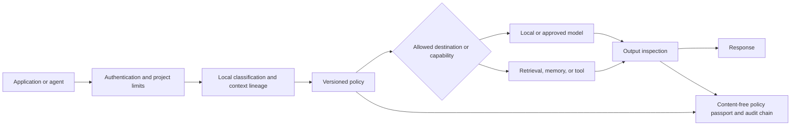

# Yagami

<!-- mcp-name: io.github.MatthewTracy/yagami -->

**Open-source AI context firewall for governed model, retrieval, memory, and tool access.**

[](https://github.com/MatthewTracy/yagami/actions/workflows/ci.yml)
[](https://pypi.org/project/yagami/)
[](https://pypi.org/project/yagami/)
[](https://github.com/MatthewTracy/yagami/blob/main/LICENSE)

[Documentation](https://matthewtracy.github.io/yagami/) | [Gateway API](https://matthewtracy.github.io/yagami/gateway/) | [Deployment](https://matthewtracy.github.io/yagami/deployment/) | [Security](https://github.com/MatthewTracy/yagami/security/policy) | [Roadmap](https://github.com/MatthewTracy/yagami/blob/main/docs/roadmap.md)

## Try it in 60 seconds

The no-credential demo uses your configured Ollama model when it is installed;
otherwise it opens a clearly labeled policy-only fallback. Choose one command:

```bash
uvx yagami demo
# or: python -m pip install yagami && yagami demo
# or: docker run --rm -p 127.0.0.1:8000:8000 ghcr.io/matthewtracy/yagami:latest yagami demo --host 0.0.0.0 --allow-remote
```

Open [http://127.0.0.1:8000](http://127.0.0.1:8000), or use
`docker compose -f compose.demo.yaml up` from a clone. Demo mode blocks cloud
routing while exercising the UI, policy, lineage, storage, and audit path. For
local AI answers, install Ollama and run
`ollama pull llama3.2:3b-instruct-q4_K_M` before starting the demo.

https://github.com/user-attachments/assets/a7be9449-eafc-4acb-99b6-ea39edc43cd2

Yagami is for developers and platform/security teams that need to control
where agent context goes and which tools it may execute. For example: a coding
agent can keep repository secrets on-device and require an identity-bound,
one-time approval before a dangerous tool call.

Yagami sits between software and local models, cloud LLMs, retrieval systems,
memory, and tools. Existing OpenAI SDK applications can adopt it by changing
one `base_url`; Yagami then classifies context locally, applies versioned
policy, and records content-free evidence for each decision.

[Take the no-data security tour](https://matthewtracy.github.io/yagami/tour/) or
run the [flagship security demos](https://github.com/MatthewTracy/yagami/tree/main/examples/flagship)
for secret containment, poisoned retrieval, and identity-bound tool approval.

## Protect an application

Initialize persistent user configuration, check the host, and start Yagami:

```bash
yagami init
yagami doctor
yagami serve
```

Install `yagami[providers]` when the Yagami process or the example client uses
Anthropic/OpenAI-compatible SDKs. PDF ingestion and OS key storage are separate
`ingest` and `desktop` extras; see [configuration](https://matthewtracy.github.io/yagami/configuration/).

Then point an OpenAI client at the gateway:

```python
from openai import OpenAI

client = OpenAI(
    base_url="http://127.0.0.1:8000/v1",
    api_key="your-yagami-project-key",
)

response = client.chat.completions.create(
    model="yagami-auto",
    messages=[{"role": "user", "content": "Summarize this document."}],
    metadata={
        "purpose": "internal-documentation",
        "sensitivity": "none",
        "session_id": "example-session",
    },
)
print(response.choices[0].message.content)
```

Supported caller sensitivity values are `none`, `phi`, `phi_medical`, and
`secret`. A caller hint can make the policy stricter; it cannot lower a
sensitivity detected by Yagami.

For production authentication, policy, and deployment settings, follow the
[deployment guide](https://matthewtracy.github.io/yagami/deployment/).

## Why teams use Yagami

- **Deterministic containment after classification.** Once context is labeled
  as PHI or secret, default policy permits local backends only. Sensitive
  history and tool results inherit the same restriction.
- **One governed data plane.** Chat Completions, Responses, the browser chat,
  and MCP use the same policy, lineage, transformation, output-DLP, budget,
  and audit pipeline.
- **Policy as code.** Preview and replay decisions, run regression cases in
  CI, and promote deterministic Ed25519-signed policy bundles.
- **Evidence without prompt logging.** Policy passports, hash-chained audit
  records, Prometheus metrics, and OpenTelemetry spans carry labels, hashes,
  IDs, and counts rather than prompt or completion content.
- **Model choice without policy duplication.** Route to local engines, direct
  cloud providers, or an existing OpenAI-compatible gateway behind one
  enforcement point.
- **Governed tools.** Evaluate function tools and MCP calls before execution,
  require short-lived one-time approvals, and keep inbound credentials from
  being forwarded to downstream servers.

## Core capabilities

| Area | Included |
|---|---|
| Compatible APIs | OpenAI Chat Completions, core Responses API, Streamable HTTP MCP |
| Identity | Scoped project API keys and OIDC/JWT workload identity |
| Policy | Versioned YAML/JSON rules, restrictive merging, preview, replay, shadow mode, regression tests, signed bundles |
| Privacy | Local classification, caller sensitivity, context lineage, AES-GCM tokenization, rehydration, output DLP, optional Presidio |
| Tools | Function calling, governed built-in skills, stdio and remote MCP, one-time approvals |
| Operations | Spend/rate/concurrency/context limits, health checks, Prometheus, OpenTelemetry, SIEM export, approval webhooks |
| Packaging | Python 3.11-3.14, PyPI, non-root container, Docker Compose, Helm, SBOMs, checksums, and build provenance |

## Models and integrations

Local generation works with [Ollama](https://ollama.com/), llama.cpp through
the optional `llama-cpp-python` runtime, and Microsoft Foundry Local through
its loopback OpenAI-compatible service. Direct cloud adapters cover Anthropic,
OpenAI, Mistral, Groq, OpenRouter, Google Gemini, and Stability AI image
generation.

Yagami also works with LangChain/LangGraph, the Vercel AI SDK, Microsoft
Presidio, Splunk HEC and generic SIEM webhooks, Slack and Teams approval
notifications, and upstream gateways such as LiteLLM, Portkey, Kong, or Envoy.
See the [integration recipes](https://matthewtracy.github.io/yagami/integrations/).

## How it compares

Yagami is not trying to replace every gateway, validator, or security scanner.
Its focus is deterministic post-classification containment, governed tool
execution, and content-free decision evidence. See the honest
[comparison guide](https://matthewtracy.github.io/yagami/comparison/) for when
LiteLLM, Guardrails AI, NeMo Guardrails, Presidio, LlamaFirewall, or a direct
provider SDK is the better choice—and how to combine them with Yagami.

## How enforcement works


```mermaid
flowchart LR
    A["Application or agent"] --> B["Authentication and project limits"]
    B --> C["Local classification and context lineage"]
    C --> D["Versioned policy"]
    D --> E{"Allowed destination or capability"}
    E --> F["Local or approved model"]
    E --> G["Retrieval, memory, or tool"]
    F --> H["Output inspection"]
    G --> H
    H --> I["Response"]
    D --> J["Content-free policy passport and audit chain"]
    H --> J
```

Policy is the final authority. Slash commands and explicit backend selection
cannot override a sensitive-data restriction. Classifier failures fail local
by default, and cloud routes can be blocked entirely or stopped at a daily
spend cap.

## Important limitations

Yagami is an enforcement component, not a compliance certification. Automated
detection can miss sensitive data. Strict deployments should declare
sensitivity at the caller, use a local-only policy, test organization-specific
cases, encrypt storage at the host or volume layer, and review the
[threat model](https://matthewtracy.github.io/yagami/threat-model/).

The project is alpha. Validate policy and failure behavior against your own
requirements before production use.

## Documentation

- [Start here](https://matthewtracy.github.io/yagami/)
- [Gateway API](https://matthewtracy.github.io/yagami/gateway/)
- [Integrations](https://matthewtracy.github.io/yagami/integrations/)
- [Deployment](https://matthewtracy.github.io/yagami/deployment/)
- [Security and threat model](https://matthewtracy.github.io/yagami/threat-model/)

## Contributing

Focused issues and pull requests are welcome. Read
[CONTRIBUTING.md](https://github.com/MatthewTracy/yagami/blob/main/CONTRIBUTING.md),
the [security policy](https://github.com/MatthewTracy/yagami/blob/main/SECURITY.md),
and the [code of conduct](https://github.com/MatthewTracy/yagami/blob/main/CODE_OF_CONDUCT.md).

## License

[MIT](https://github.com/MatthewTracy/yagami/blob/main/LICENSE) - Copyright
(c) 2026 Matthew Tracy and Yagami contributors.
