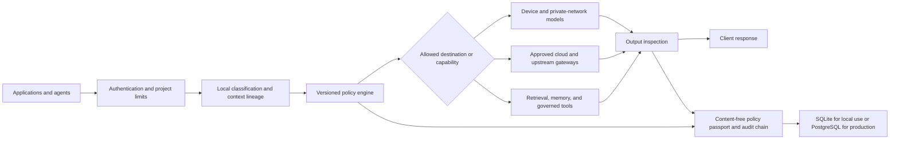

# Architecture

Yagami separates an application-facing data plane from local administration.

1. A client authenticates to `/v1`; the bearer key establishes its project.
2. Request context is normalized and caller sensitivity hints can raise, but
   never lower, the effective sensitivity.
3. Local rules and the local classifier analyze the current request.
4. The routing policy chooses a candidate backend.
5. The versioned policy engine restricts the route, allowed backends, tools,
   transformation mode, and retention.
6. Sensitive data is subject to the hard local-only invariant.
7. The selected backend streams output through Yagami. Output policies can
   buffer, inspect, redact, or block generated identifiers before delivery.
8. A content-free policy passport is recorded; decision APIs, exports, logs,
   metrics, and traces contain no prompt or response bodies.
9. Content-free decision, privacy, replay, and approval events are appended to
   a project-scoped SHA-256/HMAC chain that can be verified or exported.

The gateway service is shared by Chat Completions, Responses API, MCP, and the
browser WebSocket chat. The browser remains a local administration/demo
surface, while `/v1` is the externally supported application data plane.

SQLite is the default single-node store. PostgreSQL is the production store for
multi-replica deployments, with Redis or PostgreSQL coordination for distributed
rate limits and concurrency. Hidden gateway decision sessions are separated from
visible chat sessions through a channel field, so stateless API traffic does not
pollute the conversation sidebar.
